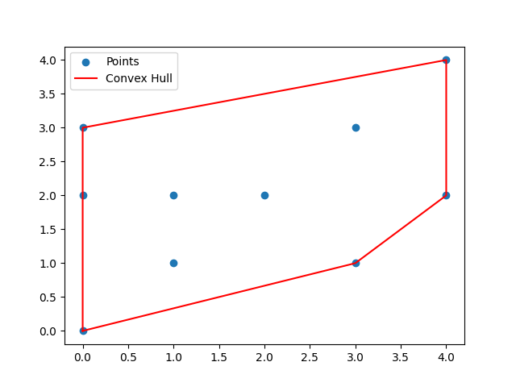

# Convex Hull Calculation with Graham's Scan Algorithm

This project implements the **Graham Scan Algorithm** to find the convex hull of a set of 2D points in Python. The convex hull is the smallest convex boundary that contains all points in a given dataset, and this implementation is efficient and robust, leveraging Python's `math` library and `matplotlib` for visualization.

## Features

- Calculates the convex hull of a set of 2D points.
- Handles edge cases, such as duplicate points and collinear points.
- Uses **polar angle sorting** and **orientation checks** to build the hull efficiently.
- Provides a visualization of the convex hull and the original points.

## Requirements

- **Python 3.x**
- **Matplotlib** for visualization (`pip install matplotlib`)

## Getting Started

1. **Clone the repository**:
    ```bash
    git clone https://github.com/your-username/convex-hull-graham-scan.git
    cd convex-hull-graham-scan
    ```

2. **Install the required libraries**:
    ```bash
    pip install matplotlib
    ```

3. **Run the program**:
    ```bash
    python app.py
    ```

## Code Structure

- **`app.py`**: Main application file containing the Graham Scan Algorithm, functions for angle calculations, orientation checks, and the convex hull plotting.

## Example Usage

Given a set of points, the program computes and displays the convex hull. For example:
```python
points = [(0, 3), (1, 1), (2, 2), (4, 4), (0, 0), (1, 2), (3, 1), (3, 3), (0, 2), (4, 2)]
```

## Explanation of Functions

- **`polar_angle(p0, p1)`**: Calculates the angle between `p0` and `p1` relative to the horizontal axis. This angle is used for sorting points in a counterclockwise order.
- **`distance(p0, p1)`**: Computes the Euclidean distance between points `p0` and `p1`. This function helps order points by distance when angles are equal.
- **`orientation(p0, p1, p2)`**: Determines the orientation of the triplet `(p0, p1, p2)`. Returns:
  - `1` for a counterclockwise turn,
  - `-1` for a clockwise turn, and
  - `0` if the points are collinear.
- **`convex_hull(points)`**: Implements Graham's Scan to construct the convex hull for a set of points. It filters duplicate points, selects the starting point, sorts by angle, and iteratively constructs the hull by maintaining only counterclockwise turns.
- **`plot_hull(points, hull)`**: Visualizes the points and the convex hull. Points are shown as scattered blue dots, and the convex hull boundary is drawn in red.

## Visualization

The program displays the points and the convex hull in a 2D plot:
- Points are marked in blue.
- The convex hull boundary is shown in red.

To add an example image in your repository, create an `images` folder in your repository and use the `savefig` function in your code to save the plot as an image. Here’s an example of how to use `savefig` in your Python code:

```python
plt.savefig("images/example_hull.png")  # Save the plot to the images folder
```

This will save the plot as `example_hull.png` inside the `images` folder. Next, to display the saved image in your `README.md`, use the following markdown syntax:

```markdown

```

This code will embed the image in your README.md file, making it visible when viewed on GitHub. Be sure to add both the images/example_hull.png file and your updated README.md to your repository before committing.

## License

This project is licensed under the MIT License. You can freely use, modify, and distribute the code, as long as proper attribution is given. See the [LICENSE](LICENSE) file for full license details.

## Contributing

Contributions are welcome! If you would like to enhance the functionality, improve the algorithm, or address any issues, please feel free to submit a pull request. For major changes, please open an issue first to discuss what you would like to change.

## Contact

For any questions, suggestions, or issues, please feel free to reach out. You can open an issue on GitHub or connect with the repository owner through their GitHub profile.

---

Thank you for checking out this project! If you found this helpful, please consider starring the repository.
